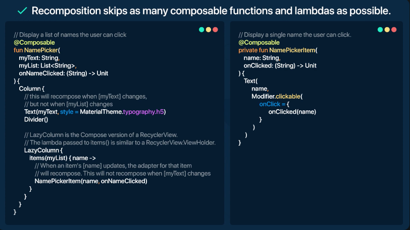

# Jetpack Compose

* Reactive programming model
* Fully declarative - By calling series of composable functions ( @Composable ) which creates the UI hierarchy
* When data changes, framework recalls the elements needed to update
* MVVM is supported.

``` kotlin
@Composable
fun MyFirstText(name: String) { // compose function name should start with uppercase
    Text(text= "Hello $name")
}

onCreate() {
    setContent { // used to set the composable view in screen
        Theme {
            MyFirstText("RV")
        }
    }
}
```

### Lifecycle of a composable
* **Initial composition** - When the UI is first created  
* **Recomposition** - When state of app changes, only the composable function uses the state is recomposed


### Recomposition
* To update data in the composable UI, the compose function is called with the new data again
* remember - used to save the data so it can be used for recomposition
* Intelligent composition - only the composable changed are updated to show UI
* Composable functions can execute in any order.
* Composable functions can execute in parallel.
* Recomposition skips as many composable functions and lambdas as possible.
* Recomposition is optimistic and may be canceled. If data is changed before function is completed, 
old one is canceled and function is called with new data.
* A composable function might run quite frequently, as often as every frame of an animation.

``` kotlin
@Composable
fun MyComposable() {
    var myValue by remember (mutableStateOf(false)} 
    Button(onClick = { myValue = !myValue }) {
        Text(text = "$myValue")
    }
}
```

