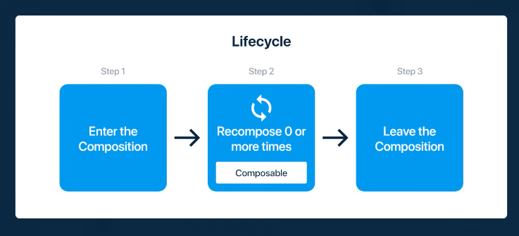

# Jetpack Compose

* Reactive programming model
* Fully declarative - By calling series of composable functions ( @Composable ) which creates the UI hierarchy
* When data changes, framework recalls the elements needed to update
* MVVM is supported.

```
@Composable
fun MyFirstText(name: String) { //compose function name should start with uppercase
    Text(text= "Hello $name")
}
```

setContent{} - used to set the composable view in screen


### Lifecycle of a composable
* **Initial composition** - When the UI is first created  
* **Recomposition** - When state of app changes, only the composable function uses the state is recomposed



